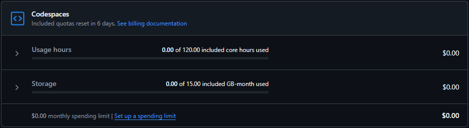

# learning-github
Repository to learn, perform tests, solve exercises and take notes about 'Git' and 'Github'.

## O que é Git e Github?
Git é um software de controle de versão, enquanto o Github é uma plataforma que dispoe de diversos serviços, entre eles, colaboração e gerenciamento de projetos, armazenamento de codigos, entre outros.

# Git
- ## Comandos úteis
    1. ### Configuração do Git
            git config --global user.name "Seu Nome"

            git config --global user.email "seu@email.com"

    2. ### Utilização do Git
        | Comandos | descrição |
        --------|--------
        | git init | Inicia um novo repositório no diretório atual. |
        | git clone {remote} | Clona um repositório Git para o diretório atual. |
        | git add . | Adiciona todas as alterações para commit. |
        | git commit -m "msg" | Realiza um commit das alterações adicionadas com a mensagem descritiva.|
        | git status | Exibe as modificações realizadas no repositório. |
        | git log | Exibe o histórico de commits do repositório. |
        | git branch | Lista todas as branchs locais e destaca a atual. |
        | git branch {nome-da-branch} | Cria uma nova branch. |
        | git checkout {nome-da-branch} | Altera para uma branch específica. |
        | git merge {nome-da-branch} | Combina as alterações de uma branch para a branch atual. |
        | git pull | Atualiza o repositório local com as alterações do repositório remoto. |
        | git push {remote} {branch} | Envia os commits para o repositório remoto. |
        | git remote -v | Lista os repositórios remotos configurados |
        | git fetch | Recupera as últimas alterações do repositório remoto, mas não faz merge automaticamente. |
        | git reset {arquivo} | Desfaz as alterações no arquivo. |
        | git rm {arquivo} | Remove o arquivo do repositório e o inclui no próximo commit. |
        | git diff | Mostra as diferenças entre as alterações que ainda não foram adicionadas ao índice. |
        | git remote add {nome-remoto} {URL} | Adiciona um repositório remoto com um nome específico. |

# Github
- ## Markdown
    - ### O que é?
        Markdown é uma linguagem de marcação leve usada para formatar texto de maneira simples e intuitiva, que pode ser convertida em HTML ou outros formatos. É amplamente utilizada em arquivos README, documentação técnica e plataformas como GitHub.

    - ### Glossário
        #### 1. Branch
        - Ramificação do código que permite trabalhar em diferentes funcionalidades sem afetar a branch principal.
        #### 2. Pull Request (PR)
        - Solicitação para integrar alterações de uma branch para outra, permitindo revisão e comentários antes da mesclagem.
        #### 3. Commit
        - Registro de uma "foto" do estado do código com uma mensagem descritiva das alterações.
        #### 4. Merge
        - Processo de unir alterações de uma branch com outra, combinando o histórico e as mudanças.
        #### 5. Fork
        - Cópia de um repositório para seu perfil, permitindo alterações sem impactar o original.
        #### 6. Clone
        - Criação de uma cópia local de um repositório remoto em seu computador.
        #### 7. Push
        - Envio de alterações do repositório local para o remoto no GitHub.
        #### 8. Pull
        - Obtém as atualizações mais recentes do repositório remoto e as combina com o código local.
        #### 9. Repository (Repositório)
        - Local onde o código e o histórico de versões de um projeto são armazenados.
        #### 10. Issues
        - Rastreamento de bugs, tarefas ou sugestões de melhoria no projeto.
        #### 11. Actions
        - Fluxos de trabalho automatizados para testes, deploys e outras tarefas.
        #### 12. GitHub Pages
        - Hospedagem de sites estáticos diretamente de um repositório GitHub.
        #### 13. Tag
        - Marca pontos específicos no histórico do repositório, frequentemente usada para identificar versões.
        #### 14. Releases
        - Versões agrupadas do código, incluindo um histórico de alterações, binários ou outros arquivos relevantes para o lançamento.
        #### 15. Wiki
        - Seção de documentação colaborativa vinculada ao repositório, permitindo criar e manter documentos relacionados ao projeto.
        #### 16. Gist
        - Ferramenta para compartilhar trechos de código ou textos pequenos com outros usuários, podendo ser público ou privado.
        #### 17. Code Review
        - Processo de revisar e comentar sobre o código enviado em pull requests para melhorar a qualidade e identificar possíveis problemas.
        #### 18. Dependency
        - Pacotes ou bibliotecas externos que o projeto usa e que são especificados para garantir que o código funcione corretamente com versões compatíveis.

    - ### Sintaxe
        | **Caractere**         | **Descrição**                                                |
        | -------------------   | ------------------------------------------------------------ |
        | `#`      | Cria títulos. Use múltiplos `#` para diferentes níveis de título (1 a 6). |
        | `**texto**`           | Deixa o texto em negrito.                                    |
        | `*texto*`             | Deixa o texto em itálico.                                    |
        | `~~texto~~`           | Aplica o efeito de texto riscado.                            |
        | `> texto`             | Cria uma citação ou bloco de citação.                        |
        | `- item` ou `* item`  | Cria uma lista não ordenada (bullets).                       |
        | `1. item`             | Cria uma lista numerada.                                     |
        | `[texto](link)`       | Cria um link com o texto clicável.                           |
        | ``      | Insere uma imagem, onde "alt" é o texto alternativo.         |
        | `` `código` ``        | Destaca uma palavra ou frase como código inline.             |
        | `---` ou `***`        | Insere uma linha horizontal (divisória).                     |
        | `[^nota]`             | Cria uma nota de rodapé.                                     |
        | `\| coluna \| coluna \|` | Cria tabelas (usado junto com hifens e pipes).            |
        | `\`                   | Escapa caracteres especiais, permitindo seu uso literal.     |

- ## Segurança
    - ### Métodos de autenticação
        1. #### Usuário e senha:
            Método mais conhecido familiaridade e facilidade, porém, recomenda-se utilizar opções mais seguras.
        2. #### Tokens de acesso pessoal:
            Também conhecidos como PATs (Tokens de Acesso Pessoal), substituem o uso do "Usuário e senha" por um token gerado previamente. Permite específicar quais ações o usuário do token pode realizar.
        3. #### Chaves SSH:
            A autenticação via chave SSH usa um par de chaves criptográficas (privada e pública) para acessar servidores remotos de forma segura, substituindo senhas. A chave privada fica com o usuário, e a pública no servidor, garantindo que apenas o detentor da chave privada possa acessar.
        4. #### Chaves de Implementação:
            Chaves de implementação são chaves digitais que dão acesso a um repositório específico no GitHub. Por padrão, permitem apenas leitura, mas podem ser configuradas para permitir escrita. Funcionam como "chaves especiais" que controlam o que pode ser feito no repositório.
            
    - ### Outras opções de segurança
        1. #### Autenticação de dois Fatores (2FA):
            2FA adiciona uma camada extra de segurança além da senha, exigindo um código gerado por um aplicativo ou enviado ao celular. Isso dificulta o acesso não autorizado, protegendo melhor a conta.
        2. #### SSO do SAML:
            O SAML SSO permite login centralizado via um provedor de identidade (como Microsoft Entra ID ou Okta). Após autenticação, o usuário ganha acesso ao GitHub sem usar senhas, facilitando o controle e segurança organizacional.
        3. #### LDAP:
            LDAP é um protocolo que organiza e gerencia o acesso a informações em diretórios corporativos. No GitHub Enterprise, ele facilita o controle centralizado de repositórios usando contas já existentes da empresa.

# Github Codespaces
- ### o que é?
    O GitHub Codespaces é um ambiente de desenvolvimento baseado na nuvem que permite criar, editar e depurar código diretamente no GitHub. Ele oferece um Visual Studio Code integrado e configurado automaticamente, sem a necessidade de instalar ferramentas ou configurar o ambiente localmente. Com ele, é possível desenvolver de qualquer lugar, em qualquer dispositivo, e colaborar com outros desenvolvedores em tempo real. Além disso, permite customizar o ambiente de desenvolvimento, facilitando o acesso a projetos em um ambiente consistente e pronto para uso.
- ### Dicas
    - #### Cobrança
        O Github Codespaces não é gratuito porém existe uma cota de horas mensais gratuita. Você deve acompanhar o uso da sua cota para não gerar cobranças indesejadas.
        
        Para acompanhar o consumo da sua cota você deve acessar a página do seu perfil no github e ir em:
        **Configurações > Billing and Plans > Plans and usage.** Encontrar o titulo "Usage this month" e encontrar o retangulo do "Codespaces" semelhante a imagem abaixo:

        
    - #### Vantagens
        Diferente do "github.dev", o "GitHub Codespaces" oferece poder computacional, pois utiliza máquinas virtuais na nuvem, permitindo execução de código, testes e compilação diretamente no ambiente, proporcionando mais recursos e flexibilidade para desenvolvimento.

        Podemos por exemplo visualizar o HTML de um projeto diretamente no navegador com o Codespaces. Para isso basta digitar o comando:

        `python -m https.server`

        Que será criado uma URL do projeto para visualizaçao diretamente no navegador.

        Outra forma de fazer isso é via extensões do VSCode que podem ser instaladas dentro do Codespaces.
        O "Live Server" é uma extensão que gera um resultado bem semelhante ao comando descrito acima, porém com a vantagem de suportar diversas linguagens e não apenas python.
        Para isso basta clicar com o botão direito no seu .html e escolher a opção "Open with Live Server" para também gerar uma URL que possibilita a visualizaçao do projeto no navegador.

        De ambas formas você terá acesso a detalhamentos via terminal do VSCode que facilitam bastante o desenvolvimento. Segue imagem dos exemplos descritos acima. O comando em Python criou o endereço na porta 8000 enquanto o Live Server criou na porta 5500.

        

-----------------------------------

  
Credits
 
  - Créditos a <a href="https://www.linkedin.com/in/allineantunnes/">Aline Antunes</a> pelo material de aprendizado -  <a href="https://aline-antunes.gitbook.io/formacao-fundamentos-github">Gitbook</a> 
   

